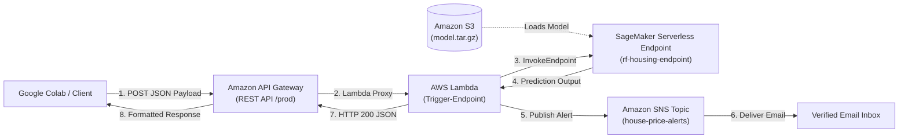

## Architecture Diagram

The system architecture follows a decoupled, serverless microservice pattern deployed in the `ap-south-1` (Mumbai) region:



## Detailed Description


------------------------------------------------------------------------------------------------
------------------------------------------------------------------------------------------------
Detailed Description


Objectives

> Automate the deployment and serving of a Scikit-Learn regression model in production.
>Ensure real-time response generation over secure HTTPS.
>Notify operators or subscribed users immediately via automated alerts when new valuations are produced.
>Implement a 100% serverless cloud footprint that incurs zero idle compute charges.

Key Features

>Serverless Inference: Hosted on an Amazon SageMaker Serverless Endpoint with 2048 MB memory and max concurrency configured to 2. It automatically scales to zero instances when traffic ceases.

>Synchronous & Asynchronous Flow: Provides instantaneous HTTP responses back to calling clients while simultaneously publishing notification payloads asynchronously to Amazon SNS.

>Resilient Ingestion: The Lambda parser normalizes multiple incoming request schemas (nested JSON dictionaries as well as raw numeric matrices).

>CORS Enabled: API Gateway includes Cross-Origin Resource Sharing headers for seamless integration with web browsers and dashboards.

Design Decisions

> SageMaker Serverless over Provisioned Real-Time Instances: Provisioned real-time instances (ml.m5.large) incur continuous hourly charges 24/7. Serverless endpoints bill strictly per millisecond of compute time during request execution.

> AWS Lambda as Central Controller: Decouples API Gateway and SageMaker, enabling schema validation, dynamic alert formatting, and error handling without coupling the client directly to ML infrastructure.

## Tech Stack

| Domain | Technology / Tool | Version / Spec |
| :--- | :--- | :--- |
| **Language** | Python | 3.10+ / 3.12 |
| **Machine Learning** | Scikit-learn, NumPy, Pandas | Scikit-learn 1.2-1 |
| **Cloud Hosting** | Amazon SageMaker | Serverless Inference |
| **Serverless Compute** | AWS Lambda | Python 3.12 Runtime |
| **API Management** | Amazon API Gateway | Regional REST API |
| **Messaging & Alerts** | Amazon Simple Notification Service | Standard Topic |
| **Object Storage** | Amazon S3 | Standard Storage Class |
| **SDK & Invocations** | Boto3, Requests | Latest |

## Folder/Module Structure

```text
aws-sagemaker-housing-pipeline/
├── README.md                                  # Project documentation and architecture guide
├── intership_email_house_predition.ipynb      # End-to-end training, deployment & test notebook
├── src/
│   ├── inference.py                           # SageMaker container inference handler (model_fn, predict_fn)
│   └── lambda_function.py                     # AWS Lambda orchestration logic (Trigger-Endpoint)
└── test/
    └── test_client.py                         # Standalone Python client script to query API Gateway

Setup & Installation Steps

Prerequisites

>An active AWS Account with administrative or sufficient IAM privileges for SageMaker, Lambda, S3, SNS, and API Gateway.

>Python 3.10+ installed locally or access to Google Colab.

>AWS CLI configured locally (aws configure) or environment credentials set inside your testing environment.

1. Model Artifact Preparation
The model must be bundled with an entry script into an archive named model.tar.gz:

tar -czvf model.tar.gz -C src/ house_price_model.pkl inference.py

Upload this artifact to your designated Amazon S3 bucket:

aws s3 cp model.tar.gz s3://rf-housing-model1/model.tar.gz --region ap-south-1

2. Amazon SNS Setup
Create the topic and subscribe an alert email address:


# Create Topic
aws sns create-topic --name house-price-alerts --region ap-south-1

# Subscribe Target Email
aws sns subscribe \
  --topic-arn arn:aws:sns:ap-south-1:YOUR_ACCOUNT_ID:house-price-alerts \
  --protocol email \
  --notification-endpoint your-email@example.com \
  --region ap-south-1

Note: Check your email inbox and click Confirm subscription in the automated verification email sent by AWS.
------------------------------------------------------------------------------------------------
3. SageMaker Serverless Endpoint Deployment
Deploy the endpoint using Boto3:
------------------------------------------------------------------------------------------------
import boto3

sm = boto3.client("sagemaker", region_name="ap-south-1")

# Create Model
sm.create_model(
    ModelName="rf-housing-model-resolved",
    PrimaryContainer={
        "Image": "[720646828776.dkr.ecr.ap-south-1.amazonaws.com/sagemaker-scikit-learn:1.2-1-cpu-py3](https://720646828776.dkr.ecr.ap-south-1.amazonaws.com/sagemaker-scikit-learn:1.2-1-cpu-py3)",
        "ModelDataUrl": "s3://rf-housing-model1/model.tar.gz",
        "Environment": {
            "SAGEMAKER_PROGRAM": "inference.py",
            "SAGEMAKER_SUBMIT_DIRECTORY": "/opt/ml/model",
            "PYTHONPATH": "/opt/ml/model:/opt/ml/model/code"
        }
    },
    ExecutionRoleArn="arn:aws:iam::YOUR_ACCOUNT_ID:role/YourSageMakerRole"
)

# Create Serverless Config
sm.create_endpoint_config(
    EndpointConfigName="rf-serverless-config-resolved",
    ProductionVariants=[{
        "VariantName": "AllTraffic",
        "ModelName": "rf-housing-model-resolved",
        "ServerlessConfig": {"MemorySizeInMB": 2048, "MaxConcurrency": 2}
    }]
)

# Deploy Endpoint
sm.create_endpoint(
    EndpointName="rf-housing-endpoint",
    EndpointConfigName="rf-serverless-config-resolved"
)
------------------------------------------------------------------------------------------------
4. AWS Lambda ConfigurationCreate a function named Trigger-Endpoint (Python 3.12). Attach the following IAM policies to its execution role:
AWSLambdaBasicExecutionRole
AmazonSageMakerFullAccess
AmazonSNSFullAccess
Set the function Timeout to 0 min 30 sec under Configuration $\rightarrow$ General configuration.

5. Amazon API Gateway Integration
Create a REST API (HousingPredictionAPI).
Add a POST method on resource /.
Enable Lambda Proxy Integration and point to Trigger-Endpoint.
Enable CORS from the Actions dropdown.
Deploy API to stage prod and capture the generated Invoke URL.
------------------------------------------------------------------------------------------------
------------------------------------------------------------------------------------------------
Usage Instructions
Run via cURL

curl -X POST https://YOUR_API_[ID.execute-api.ap-south-1.amazonaws.com/prod](https://ID.execute-api.ap-south-1.amazonaws.com/prod) \
  -H "Content-Type: application/json" \
  -d '{
    "inputs": [
      [0.5, 0.5, 0.5, 0.5, 0.5, 0.5, 0.5, 0.5]
    ]
  }'
------------------------------------------------------------------------------------------------
------------------------------------------------------------------------------------------------
Run via Python
------------------------------------------------------------------------------------------------
import requests

api_url = "https://YOUR_API_[ID.execute-api.ap-south-1.amazonaws.com/prod](https://ID.execute-api.ap-south-1.amazonaws.com/prod)"

payload = {
    "inputs": [
        [0.5, 0.5, 0.5, 0.5, 0.5, 0.5, 0.5, 0.5]
    ]
}

response = requests.post(api_url, json=payload)
print("HTTP Status Code:", response.status_code)
print("Response JSON:", response.json())

------------------------------------------------------------------------------------------------
------------------------------------------------------------------------------------------------
Sample Expected Output
------------------------------------------------------------------------------------------------
JSON
{
  "predicted_price": [1.535350399999998],
  "notification": "Email notification dispatched successfully"
}
------------------------------------------------------------------------------------------------
Email Notification Delivered:
------------------------------------------------------------------------------------------------
Plaintext
Subject: Prediction Alert
From: AWS Notifications <no-reply@sns.amazonaws.com>

House Price Prediction Alert

Input Features: [[0.5, 0.5, 0.5, 0.5, 0.5, 0.5, 0.5, 0.5]]
Predicted Price: [1.535350399999998]
------------------------------------------------------------------------------------------------
Resource Teardown (Cost Control)
------------------------------------------------------------------------------------------------
Python
import boto3

sm = boto3.client("sagemaker", region_name="ap-south-1")

sm.delete_endpoint(EndpointName="rf-housing-endpoint")
sm.delete_endpoint_config(EndpointConfigName="rf-serverless-config-resolved")
sm.delete_model(ModelName="rf-housing-model-resolved")

print("SageMaker endpoint resources deleted successfully.")
------------------------------------------------------------------------------------------------
> Author Information
> Author: Antony Joji
> GitHub: @AntonyJoji
> Project Repository: aws-sagemaker-housing-pipeline
