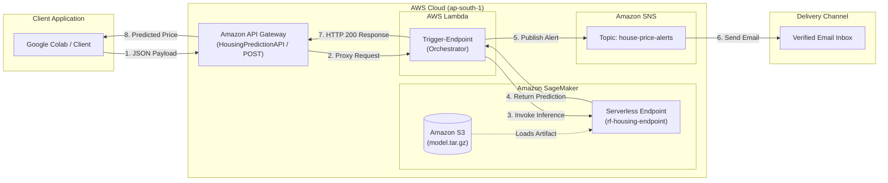

# aws-sagemaker-housing-pipeline
## Architecture Diagram

```mermaid
flowchart LR
    subgraph Client["Client Application"]
        Colab["Google Colab / Client"]
    end

    subgraph AWS["AWS Cloud (ap-south-1)"]
        APIGW["Amazon API Gateway\n(HousingPredictionAPI / POST)"]
        
        subgraph LambdaGroup["AWS Lambda"]
            Lambda["Trigger-Endpoint\n(Orchestrator)"]
        end

        subgraph SageMakerGroup["Amazon SageMaker"]
            S3[("Amazon S3\n(model.tar.gz)")]
            Endpoint["Serverless Endpoint\n(rf-housing-endpoint)"]
        end

        subgraph SNSGroup["Amazon SNS"]
            SNSTopic["Topic: house-price-alerts"]
        end
    end

    subgraph Notification["Delivery Channel"]
        Email["Verified Email Inbox"]
    end

    Colab -->|1. JSON Payload| APIGW
    APIGW -->|2. Proxy Request| Lambda
    S3 -.->|Loads Artifact| Endpoint
    Lambda -->|3. Invoke Inference| Endpoint
    Endpoint -->|4. Return Prediction| Lambda
    Lambda -->|5. Publish Alert| SNSTopic
    SNSTopic -->|6. Send Email| Email
    Lambda -->|7. HTTP 200 Response| APIGW
    APIGW -->|8. Predicted Price| Colab
```
